# 🏠 HostelHunt


**A modern, sleek, and user-friendly iOS application for discovering and booking hostels.**  
Built with **SwiftUI** and powered by **Supabase**, HostelHunt makes it simple for travelers to explore, wishlist, and reserve accommodations worldwide.  

---

## 📖 Project Overview

HostelHunt is designed to deliver a **frictionless hostel booking experience**.  
Users can search for hostels, manage their profiles, and earn rewards — all wrapped in a clean and futuristic UI.  

✨ The **rewards program** makes travel not just affordable, but also more rewarding.

---

## 🛠 Core Technologies

- **Framework:** [SwiftUI](https://developer.apple.com/xcode/swiftui/) (modern declarative UI)  
- **Backend:** [Supabase](https://supabase.com/)  
  - 📂 Database → Hostel listings, reservations, wishlists  
  - 🔑 Authentication → Supabase Auth (email/password, OAuth)  
  - 🔔 Real-time → Reservation & availability updates  
- **Database:** PostgreSQL (via Supabase)  

---

## 📸 Screenshots

**Actual app looks even better in action!** 😍  

<p align="center">
  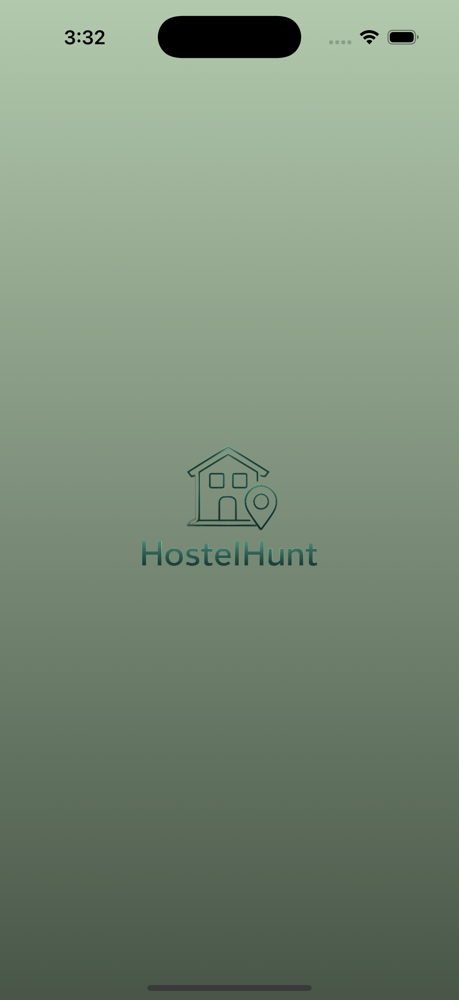
  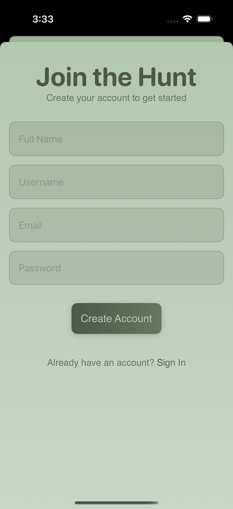
  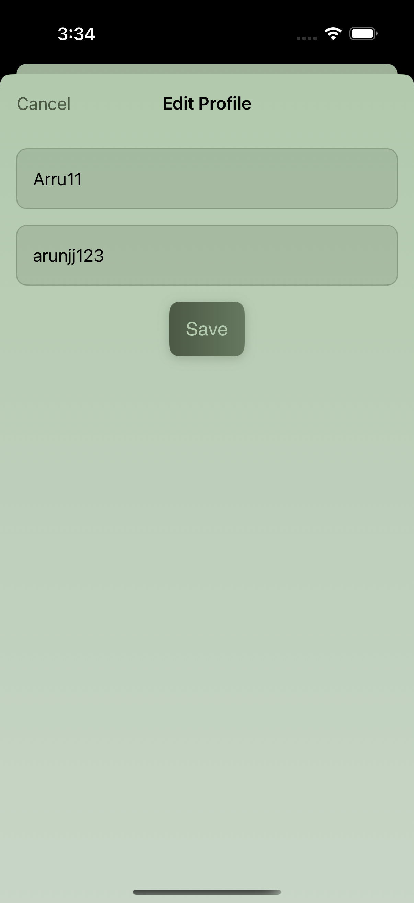
  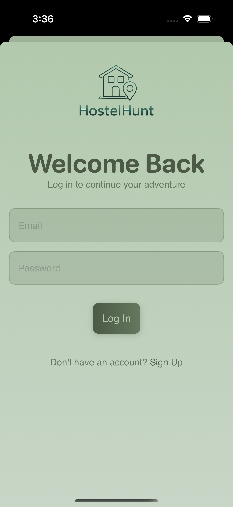
  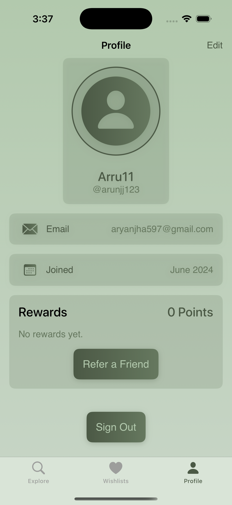
  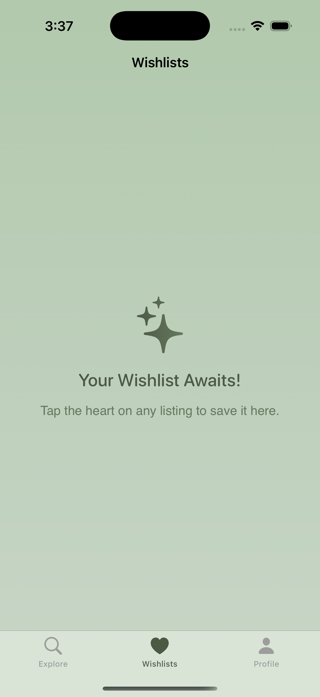
  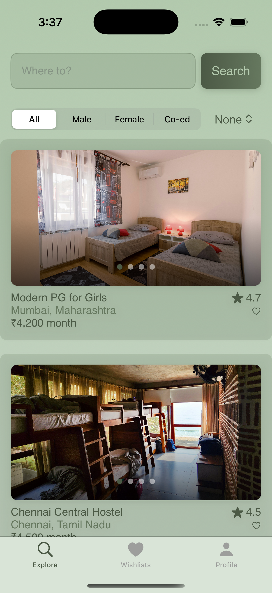
  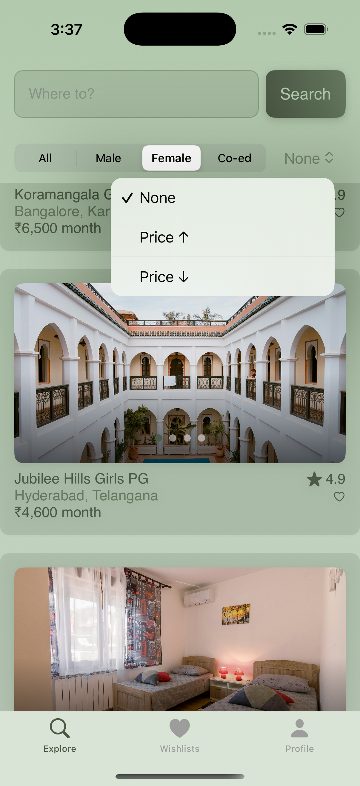
  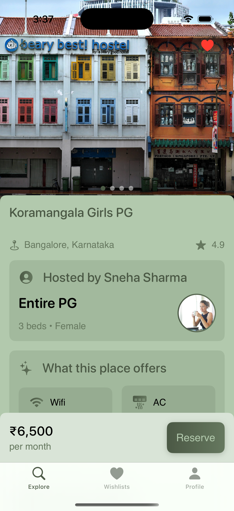
  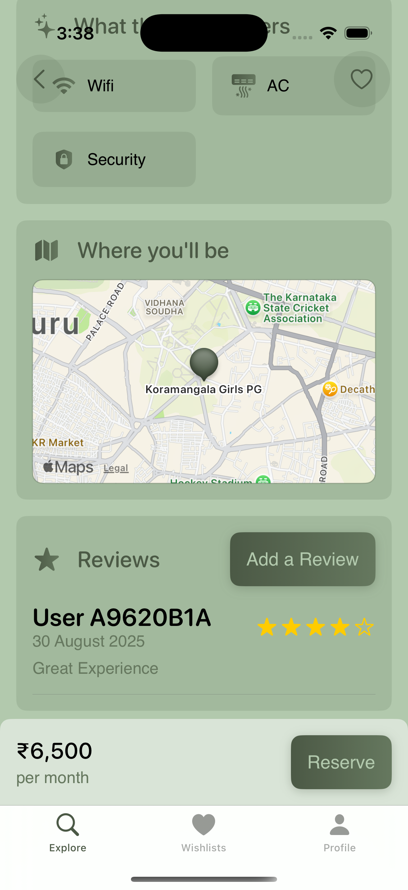
  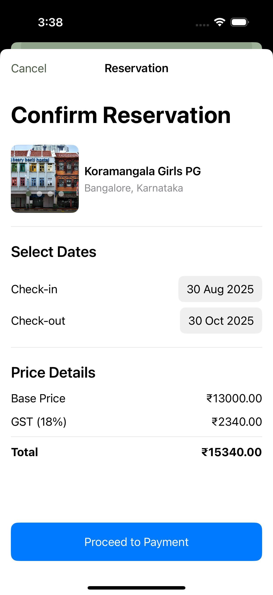
  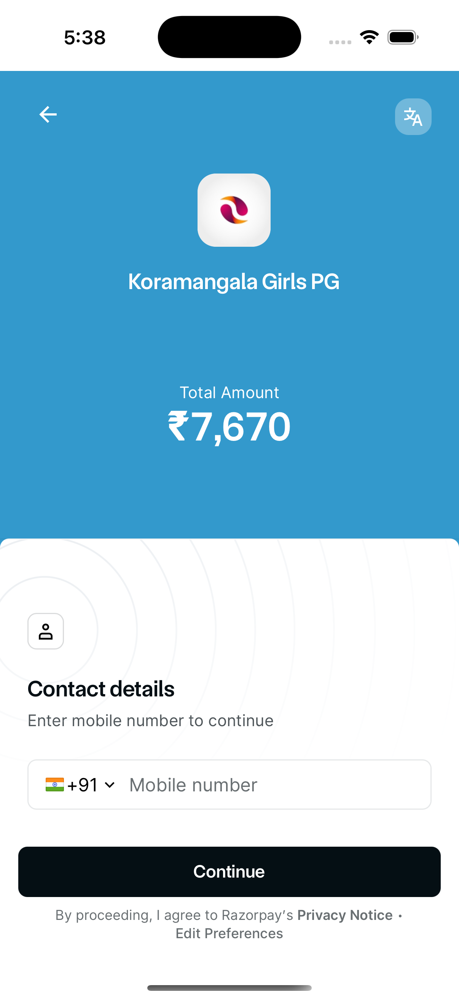
</p>


---

## ✨ Features

- 🔍 **Explore hostels** with filters (location, price, amenities)  
- ❤️ **Wishlist system** for saving favorite hostels  
- 📅 **Reservations** with secure booking flow  
- 👤 **User profiles** with booking history & favorites  
- 🎁 **Rewards program** for loyal users  
- 🎨 **Modern SwiftUI UI** with smooth transitions  

---

## 🔄 Application Flow

- **Splash Screen** → App initializes & checks authentication  
- **Login / Signup** → Supabase Auth  
- **Explore Screen** → Hostel listings with filters  
- **Details Screen** → Hostel info + booking option  
- **Wishlist Screen** → Saved hostels  
- **Profile Screen** → User details, bookings, rewards  

---

## 📂 Project Structure

- HostelHunt/
  ┣ Models/         # Data models (Hostel, User, Booking)  
  ┣ Services/       # Supabase API integration  
  ┣ Views/          # SwiftUI screens  
  ┣ Components/     # Reusable UI components  
  ┣ Assets/         # App assets (images, icons)  

---

## 📦 Installation

1. Clone the repo:
   ```bash
   git clone https://github.com/your-username/HostelHunt.git
   cd HostelHunt
